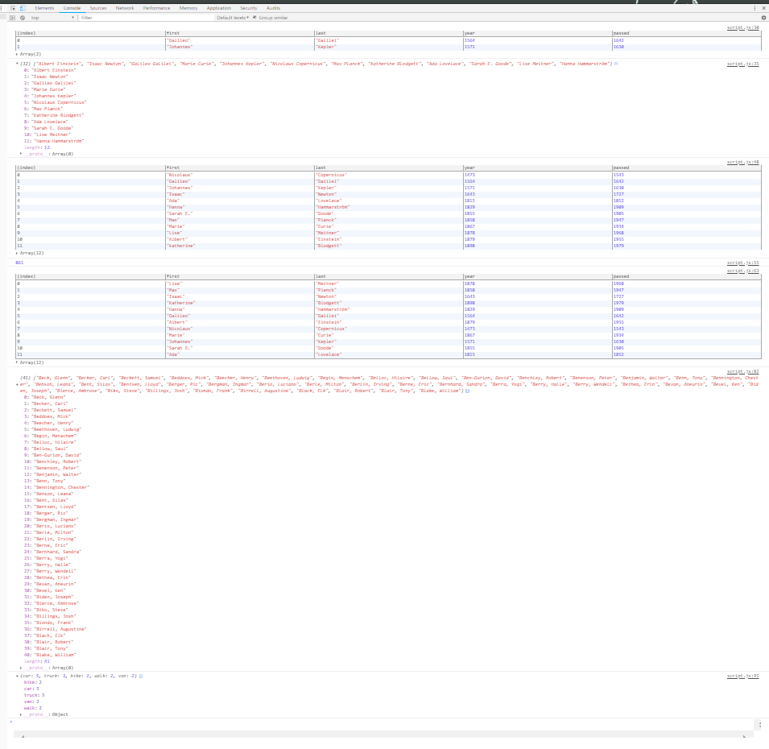

30 day JavaScript Challenge by Wes Bos, day 4: Array Cardio Day 1. 
Today we went through several ways to manipulate an array. It was pretty fast paced with the video, so it makes sense that he calls it cardio. It's one excersize after another, and your brain feels like it just did a HIIT workout. Good stuff.

;
